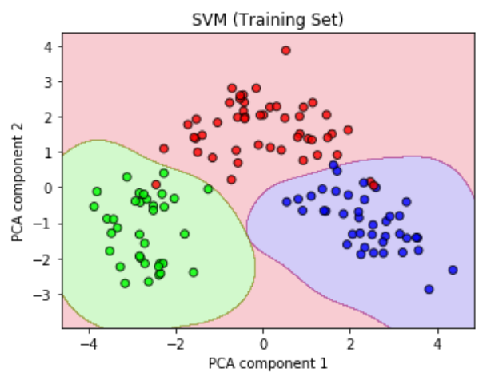
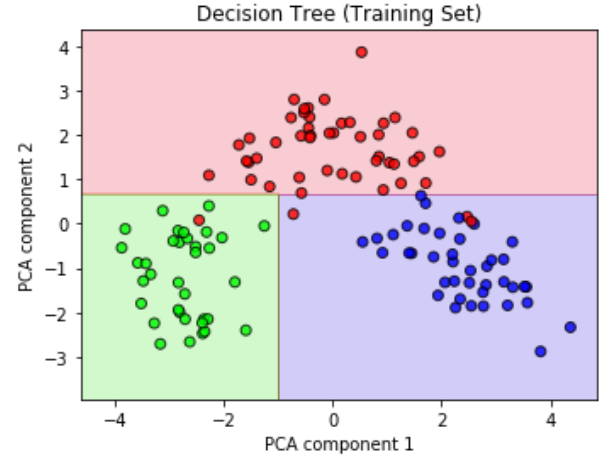
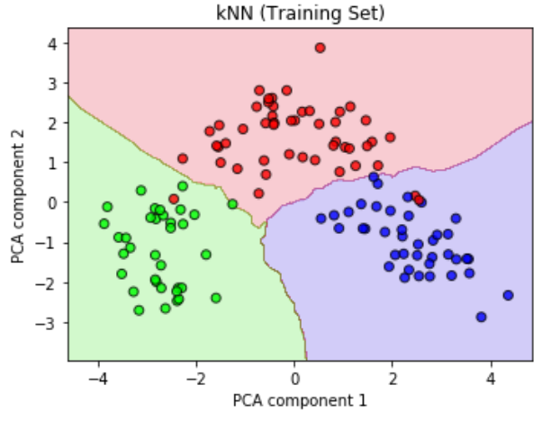

# Wine Classification
Comparison of classification algorithms implemented in scikit-learn using a dataset of wines and their chemical composition

[View the jupyter notebook here](https://nbviewer.jupyter.org/github/christopherbronner/Wine_Classification/blob/master/Classifiers%20Wine.ipynb)

In this notebook, I use six different classification algorithms implemented in scikit-learn and apply them to a dataset of wines which are characterized by their chemical composition and categorized into three classes. 

In order to be able to visualize the data, I use dimensionality reduction via principal component analysis (PCA) to reduce the number of features from 13 to 2. I then go through each of the six classification algorithms and fine-tune them using validation curves, grid search and other tools. Each classifier is then visualized in the reduced two-dimensional feature space.

